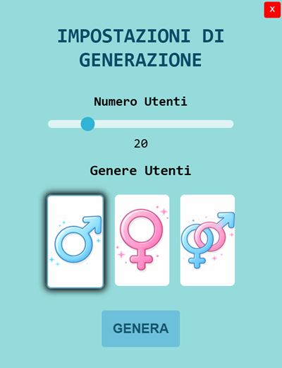
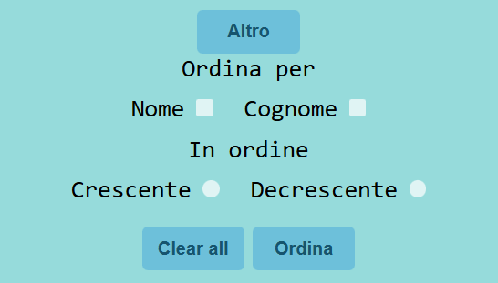

# Progetto Random User

## Introduzione

Questo progetto è una semplice applicazione web, **realizzata da me con il supporto di mia sorella per le scelte grafiche**, che permette di generare degli utenti in modo casuale attraverso l'utilizzo di una **API** gratuita fornita da <https://randomuser.me>. 

## Strumenti Utilizzati

- **HTML**
- **CSS**
- **JS**
- **JQUERY**
- **AJAX**

## Funzionamento dell'applicazione

L'applicazione all'avvio si presenta con i pulsanti ***Genera***,  ***Ordinamenti*** e ***Rigenera***, una ***Search Bar***, la ***Griglia di Visualizzazione***, con i 20 utenti maschi generati di default, e i ***Pulsanti di Navigazione*** della griglia.

### Pulsante Genera

Dopo il click sul pulsante genera si aprirà una **finestra modale**.

In questa finestra modale si potranno gestire le impostazioni di generazione.

Attraverso lo slider si sceglierà il numero di persone desiderato e attraverso il click sui simboli universali di genere si potrà scegliere se le persone da generare saranno maschi, femmine o entrambi.

Cliccando sul pulsante ***GENERA*** si chiuderà la finestra e verranno generati gli utenti.

Cliccando sulla ***X Rossa*** in altro a destra si chiuderà la finestra senza generare nuovi utenti.

### Pulsante Genera

Dopo il click sul pulsante genera si aprirà una **finestra modale**.

In questa finestra modale si potranno gestire le impostazioni di ordinamento degli utenti generati.

Cliccando sulla ***X Rossa*** in altro a destra si chiuderà la finestra senza cambiare l'ordine attuale degli utenti.

Cliccando su ***Altro*** compariranno altre impostazioni di ordinamento.

#### Ordinamenti possibili

- Scegliendo una o più nazioni verranno visualizzati solo gli utenti di quelle nazioni
- Scegliendo una o più nazioni e crescente o decrescente verranno visualizzati solo gli utenti ordinati in base alle nazioni scelte secondo l'ordine scelto
- Non scegliendo nessuna nazione e scegliendo nome o cognome gli utenti verranno ordinati in ordine o crescente o decrescente. **Nota: appena si sceglie nome o cognome viene automaticamente selezionato l'ordine crescente**.
- Scegliendo sia nome che cognome gli utenti verranno ordinati in base al nome o in base al cognome se qualche utente presenta lo stesso nome.
- Scegliendo solo crescente o decrescente tutti gli utenti verranno ordinati in base alle loro nazioni secondo l'ordine selezionato.
- Scegliendo una o più nazioni e nome o cognome o entrambi posso ordinare gli utenti di specifiche nazioni in base ai campi selezionati in ordine crescente o decrescente.
- Scegliendo più nazioni e crescente o decrescente potrò ordinare gli utenti di specifiche nazioni secondo l'ordine selezionato.

#### Pulsante Ordina e Clear all

Cliccando su ***Ordina*** verranno ordinati gli utenti in base alle impostazioni scelte.

Cliccando su ***Clear all*** verranno azzerate tutte le impostazioni di ordinamento facendo visualizzare gli utenti senza alcun ordinamento.

### Pulsante Rigenera

Cliccando su ***Rigenera*** verranno semplicemente rigenerati gli utenti con le impostazioni di generazione attualmente presenti.

### Griglia di Visualizzazione e Pulsanti di Navigazione

Nella Griglia di Visualizzazione vengono visualizzati al massimo quattro utenti per volta, per visualizzare gli altri utenti è sufficiente utilizzare i pulsanti di navigazione a forma di frecce per cambiare pagina della griglia.

Cliccando sugli utenti visualizzati si apriprà una finesta modale dove si potranno vedere alcuni dettagli aggiuntivi sugli utenti.

### Search Bar

Nella ***Search Bar*** sopra la griglia si potrà cercare uno o più utenti in base al loro nome e cognome e verranno visualizzati sulla griglia.

Su questi utenti, inoltre, sarà possibile anche applicare gli ordinamenti che sono stati descritti in precedenza.

